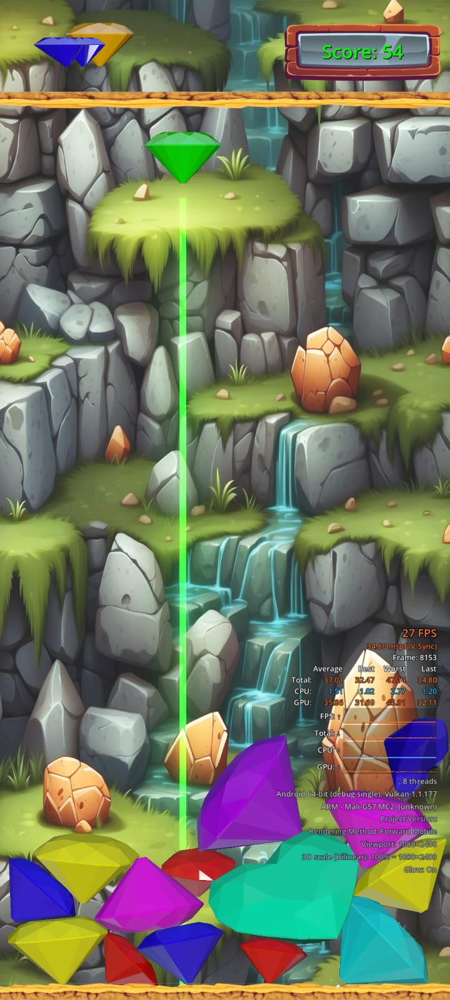

# Jewel Merge 

Jewel Merge es un juego de combinación de gemas donde debes fusionar joyas del mismo nivel y color.

## Descripción  

- Joyas caen aleatoriamente desde arriba
- Posiciona joyas para que coincidan con otra del mismo color y nivel  
- Al combinar se fusionan en una joya de mayor nivel
- Puntaje incrementa por cada combinación  
- Bonos por combinaciones rápidas seguidas   
- Leaderboard global

## Avance

- [X] Instanciación y posicionamiento de joyas 
- [X] Control de puntaje
- [X] Efectos de sonido
- [X] Efectos de explosión al combinar
- [ ] Poderes especiales por puntaje alto
- [X] Físicas de joyas que caen   
- [ ] Tema musical de fondo
- [ ] Láser indicador 
- [ ] Modelos 3D de joyas

## Características deseadas

- Skins alternativos
- Tablero tangible  
- Multijugador en línea
- Sonido envolvente 3D

## Capturas de pantalla



*Pantalla de inicio*

  

*Efecto al realizar una combinación* 

## Tecnologías

```
- Godot
- C#
- GDscript
```